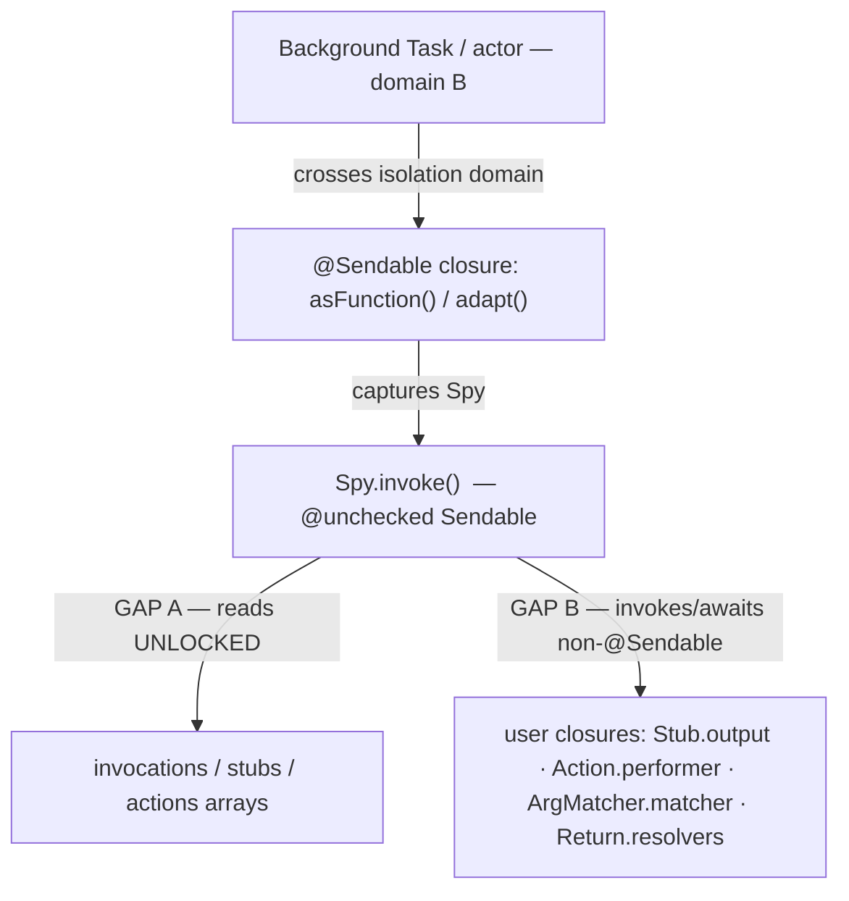

# Swift 6 Data-Race-Safety Audit — Resolution Record

> Status: **IMPLEMENTED** — all P0/P1/P2 work and the core of P3 are complete on the `improved_concurrency` branch (14 commits, `740f6fb`…`8441569`).
> This document records the original audit findings and how each was resolved, with verification evidence.
> Toolchain: **Swift 6.3**; `swift-tools-version: 6.0`.

---

## Table of contents

1. [Outcome](#1-outcome)
2. [The original problem](#2-the-original-problem)
3. [Resolution ledger](#3-resolution-ledger)
4. [Compatibility with Swift 5 consumers and non-Sendable types](#4-compatibility-with-swift-5-consumers-and-non-sendable-types)
5. [Engineering lessons discovered during the work](#5-engineering-lessons-discovered-during-the-work)
6. [Source-breaking changes (migration notes)](#6-source-breaking-changes-migration-notes)
7. [Test hardening recommendations](#7-test-hardening-recommendations)
8. [What remains](#8-what-remains)
9. [Evidence basis](#9-evidence-basis)

---

## 1. Outcome

| Track | Result |
|---|---|
| **P0** — proven data races | ✅ All fixed; every fix demonstrated with Thread Sanitizer (before = race + abort, after = clean) |
| **P1** — earn `Sendable` | ✅ `Spy`/`Mock` honestly `@unchecked Sendable` (real locking); `AnySpy: Sendable`; **every stored user closure is now compiler-proven `@Sendable`** |
| **P2** — generated mocks | ✅ Generated mocks are `Sendable` via inheritance from `Mock`; verified by a compile-time test |
| **P3** — Swift 6 language mode | ✅ Library + test-support + both test targets build in Swift 6 mode (0 errors) |

**Verification standing:** 163 XCTest + 6 swift-testing tests green; 10 `race_condition` regression guards, all clean under Thread Sanitizer. The test targets flipped to Swift 6 with **zero source changes** — the concurrency-heavy test code satisfied strict checking as-is, which is the `Sendable` work paying off.

Every remaining `@unchecked Sendable` annotation (`Spy`, `Mock`, `InvocationRecorder`, `SpyStorageProvider`, `Action`, one `KeyPath` box) is backed by real locking or immutability — no annotation theater survives.

---

## 2. The original problem

The audit found two distinct gaps:

- **Gap A — unsound `@unchecked Sendable`.** Synchronization was write-only; read and reset paths were unlocked. Real data races, TSan-detectable.
- **Gap B — stored closures weren't `@Sendable`.** Return-producers, side-effects, and matchers could capture arbitrary non-Sendable state and were invoked — and for async, *awaited* — across isolation domains via the `@Sendable` adapter closures.

Both gaps are now closed: Gap A by complete locking (P0 + property synchronization), Gap B by requiring `@Sendable` at every public closure boundary and threading the requirement through the storage types (P1-1).

---

## 3. Resolution ledger

### P0 — Data races (all resolved, TSan-proven)

| # | Issue | Status | Commit | TSan evidence |
|---|---|---|---|---|
| P0-1 | `Spy` read paths unlocked (`invocationCount`, `verify`, `matchingStub`, `verifyThrows`) | ✅ | `740f6fb` | `Swift access race` in `Spy.intake` → clean |
| P0-2 | `Spy.clear()` reset without locks | ✅ | `740f6fb` | same run |
| P0-3 | `Mock.clear()` / `isLoggingEnabled` didSet read `spies` unlocked | ✅ | `0c0faf7` | 2 races at `Mock.subscript.getter` → clean (deep copy required — see Lesson 1) |
| P0-4 | `Stub.output` closure reassign-vs-invoke race | ✅ | `0746f06` | `data race` in `Stub.output.getter` → clean. `Action.*Performer` audited race-free (see Lesson 2) |
| P0-5 | Adapters rewrote `spy.defaultProviderRegistry` on every call, unlocked | ✅ | `9e6aecc` | `data race` in `Spy.defaultProviderRegistry.setter` → clean; the write was also redundant work, now removed |
| — | Spy snapshot helpers hardened to deep copies | ✅ | `1fd545b` | defensive (Lesson 1 applied retroactively) |

### P1 — Earn `Sendable` (all resolved)

| # | Issue | Status | Commit |
|---|---|---|---|
| P1-1 | Stored user closures non-`@Sendable` (handlers, performers, matchers) | ✅ | `0c7472e` (stubbing side), `8441569` (matcher side) |
| P1-2 | `Stub`/`Return`/`Arrange`/`Assert` carried no `Sendable` | ✅ superseded | Explicit conformances proved unnecessary once their closures became `@Sendable` and their containers locked; `Return` additionally gained direct value/error storage (Lesson 3) |
| P1-3 | `Spy` `@unchecked Sendable` unjustified | ✅ | `740f6fb`, `1fd545b`, `b94a9f1`, `3986350` — collections, config vars, and public getters all synchronized; annotation now honest |
| P1-4 | `Mock` non-`Sendable` | ✅ | `1b7db30` — `@unchecked Sendable` with `spies` getter, `defaultProviderRegistry`, `isLoggingEnabled` synchronized |
| P1-5 | `AnySpy` no `Sendable` bound | ✅ | `17c5d88` — `AnyObject, Sendable` (sound once `Spy` is honest) |
| P1-6 | `Spy.logger` mutable non-`@Sendable` closure | ✅ | `b94a9f1` (locked), `0c7472e` (`@Sendable`-typed) |
| P1-7 | `Recorded.arguments: [Any]` type-erases user values | ✅ | Unsound `@unchecked Sendable` removed from `Recorded` (PR review follow-up); the recorder class itself remains soundly locked |

### P2 — Generated mocks (resolved, no generator change needed)

| # | Issue | Status | Commit |
|---|---|---|---|
| P2-1 | Macro emits non-`final`, non-`Sendable` classes | ✅ via inheritance | `1b7db30` marked `Mock` `@unchecked Sendable`, so every generated mock inherits it; `17c5d88` added `test_generated_mock_of_sendable_protocol_is_sendable` — a compile-time proof (assignable to `any Sendable`, capturable in a `@Sendable` closure) |
| P2-2 | No `.sendable` codegen option | ✅ superseded | Inheritance made the option unnecessary |
| P2-3 | Plugin injects nothing | n/a | unchanged by design |

### P3 — Swift 6 language mode (core resolved)

| # | Issue | Status | Commit |
|---|---|---|---|
| P3-1 | No Swift 6 mode | ✅ (library, test-support, both test targets) | `1eb8426`, `860fac0` — 0 build errors |
| P3-2 | `#SendableMetatypes` captures (`DefaultProviding.numeric`, `TestSupport` `Eff.Type`) | ✅ | `1eb8426` — `numeric<T: Numeric & Sendable>`; `Effect: Sendable` (+ the four marker enums) makes `Eff.Type` Sendable |
| P3-3 | `approximately` default-expression inference | ⚠️ warning-only | Hard error is for a *future* language mode; every alternate signature fails to type a float literal as a generic `FloatingPoint` (documented in `1eb8426`) |
| P3-4 | Eligible types missing explicit `Sendable` | ✅ mostly | `dc8f1fe` (`MockingError`, `UntilError`), `1eb8426` (`Effect` + marker enums); trait structs still lack explicit declarations (open, minor) |

### P4 — General quality (untouched)

All P4 cleanups from the original audit remain open: dead `hasStaticMembers`, misleading `mockStruct` name, `.prefixMock` default vs. docs, `InvocationRecorder.shared` default inconsistency, `var`→`let` on `DefaultProviding`, `withDefaults` async-only overload, `Assert.captures` escaping closure, `#if DEBUG` codegen decision, cosmetic formatting.

---

## 4. Compatibility with Swift 5 consumers and non-Sendable types

### Swift 5 compatibility

- **Toolchain floor is unchanged.** The package already declared `swift-tools-version: 6.0` before this work, so consumers always needed a Swift 6.0+ toolchain (Xcode 16+). Nothing this branch did raised it.
- **Language mode is per-module.** A consumer target building in **Swift 5 language mode** can import the (Swift 6 mode) library without change. The stricter checking applies only to the library's own compilation.
- **How the new requirements degrade for Swift 5-mode consumers:**
  - `where O: Sendable` / `E: Error & Sendable` / `each I: Sendable` **constraints** are hard type-system requirements — enforced in any language mode. Value stubbing of non-Sendable types is unavailable regardless of mode.
  - `@Sendable` **closure capture violations** at call sites are checked in the *caller's* module, so a Swift 5-mode consumer sees **warnings, not errors**, for non-Sendable captures in handler closures.
- **Residual risk:** nothing continuously verifies the Swift 5-mode consumer path. See §7.

### Mocking non-Sendable types — what still works

| Use case | Status | Workaround when constrained |
|---|---|---|
| `@Mockable` on a protocol with non-Sendable associated types / requirements | ✅ fully supported | — |
| Mock of a `: Sendable` protocol | ✅ (inherits `@unchecked Sendable` from `Mock`) | — |
| Matching non-Sendable arguments | ✅ via `.any` and `.any(that:)` — predicates may *take* non-Sendable params; only their *captures* must be Sendable | Compare identity by capturing an `ObjectIdentifier` (Sendable) instead of the instance |
| Value-capturing matchers (`.equal`, `.identical`, `.contains`, …) on non-Sendable args | ❌ constrained to `Sendable` arguments | `.any(that:)` with Sendable captures |
| Stubbing a **non-Sendable return** with a value (`thenReturn(instance)`) | ❌ requires `Output: Sendable` | `thenReturn { _ in NonSendableThing() }` — a `@Sendable` closure may *return* a non-Sendable type; it just can't *capture* one. Construct the value inside the handler. |
| Default-value fallback for non-Sendable returns | ✅ unconstrained (`Return` stores values directly, no closure capture) | — |
| `thenThrow(nonSendableError)` | ❌ requires `E: Error & Sendable` | `.thenReturn { _ in throw NonSendableError() }` (construct inside) |
| Handler-based stubbing where **arguments** are non-Sendable (async/throwing deferred overloads) | ❌ requires `each I: Sendable` | Static `Sendable` return stubbing still works; or restructure the test |
| Sync, non-throwing handler stubbing with non-Sendable args | ✅ (runs inline, no invocation capture) | — |

These constraints are the deliberate consequence of the **Mandatory `@Sendable`** decision: the compiler now proves every closure the library stores and later invokes across isolation domains captures only Sendable state. If real-world usage shows a painful gap, a scoped escape hatch (e.g. an explicitly-named `thenReturnUnsafely`-style API with documented risk) can be added later without reopening the default.

---

## 5. Engineering lessons discovered during the work

1. **A shallow CoW snapshot that escapes the lock is not thread-safe** — even when every access to the underlying property is locked. `return spies` shares storage with `self.spies`; iterating that copy outside the lock while a writer resizes the collection races inside `_NativeDictionary._copyOrMoveAndResize`. Deep copies (`mapValues { Array($0) }`, `Array(...)`) are what actually fix it. Proven for dictionaries; applied defensively to arrays.
2. **`Action` was race-free all along** — its performers are set *before* the locked `registerAction`, and the register/match `NSLock` barrier establishes happens-before, so `perform` always observes the published performer. No lock was added; the reasoning is recorded in `0746f06`.
3. **Direct storage beats closure capture for values.** `Return.value`/`Return.error` originally wrapped values in closures; making resolvers `@Sendable` would have forced `R: Sendable` on *every* stubbed return type. Storing `storedValue`/`storedError` directly keeps value factories — and the internal default-value fallback in `Spy.invoke` — unconstrained, while handler-driven returns use `@Sendable` resolvers.
4. **The race tests the repo shipped could not fail.** The pre-existing `*_race_condition` tests only exercised write/write paths that were already locked. Each fix came with a new read/write race guard that TSan demonstrably catches on the unfixed code.

---

## 6. Source-breaking changes (migration notes)

1. **Handler closures are `@Sendable`.** `.thenReturn { … }` and `.do { … }` closures capturing non-Sendable state no longer compile (warnings only for Swift 5-mode callers). Wrap shared state in a locked box or actor, or construct values inside the handler.
2. **Value stubbing requires `Sendable` values.** `thenReturn(value:)` needs `Output: Sendable`; `thenThrow` needs `E: Error & Sendable`; the deferred (async/throwing) handler overloads need `each I: Sendable`. Handler-based stubbing of non-Sendable returns still works — construct the value inside the handler.
3. **Matcher predicates are `@Sendable`**, and value-capturing matchers (`.equal`, `.identical`, `.contains`, `.in`, `.approximately`, key-path `any(where:)`) require `Sendable` arguments. Use `.any(that:)` with Sendable captures (e.g. `ObjectIdentifier`) for non-Sendable arguments.
4. **DX note:** `.any(that: { … })` may require an explicit `@Sendable` in some positions — `@Sendable` inference does not always propagate through the `.any(that:)` member chain.
5. **`Mock` is now `@unchecked Sendable`** — generated mocks inherit the conformance and satisfy `: Sendable` protocol requirements.
6. **`Recorded` is no longer `Sendable`.** Its type-erased `arguments: [Any]` payload cannot soundly claim transfer across concurrency domains; consume `InvocationRecorder.snapshot()` within a single isolation domain.

---

## 7. Test hardening recommendations

1. **Run the race guards under Thread Sanitizer in CI.** The ten `race_condition` tests only *prove* anything when built with `-sanitize=thread`; in normal runs they pass vacuously. A CI step (`swift test --sanitize=thread --filter race_condition`) on a macOS runner keeps the guarantee alive. This is the highest-value hardening.
2. **A Swift 5 language-mode consumer lane.** Add a small test target compiled with `swiftLanguageMode(.v5)` that imports and exercises the public API, so regressions in the Swift 5 consumer path (§4) are caught continuously instead of assumed.
3. **Non-Sendable usage fixtures.** Tests that mock a protocol with non-Sendable parameter/return types using the documented workarounds (handler-constructs-value, `ObjectIdentifier` matching, default-value fallback), locking in the §4 support story so future changes don't silently break the escape hatches.
4. Optional: raise race-guard iteration counts if flakiness is ever suspected; current guards trigger reliably (verified before/after during the fixes).

---

## 8. What remains

- **P3 (tail)**: flip the macro host targets (`MockableGenerator`, `SwiftMockingMacros`, `SwiftMockingOptions`) to Swift 6 mode — compile-time tooling, low value. Explicit `Sendable` on the swift-testing trait structs. The `approximately` warning.
- **P4**: the cleanup list above.
- **§7 hardening**: TSan CI step, Swift 5 consumer lane, non-Sendable fixtures.
- Suggested follow-up: a CHANGELOG entry covering §6 before the next minor release.

---

## 9. Evidence basis

- Every fix in P0/P1 was demonstrated with Thread Sanitizer (`swift test --sanitize=thread --filter race_condition`): the new regression test races and aborts on the unfixed code, and is clean after. Ten `race_condition` guards now ship in the suite.
- Full-suite verification after every increment: 163 XCTest + 6 swift-testing tests, 0 failures.
- The generated-mock `Sendable` claim is verified by `test_generated_mock_of_sendable_protocol_is_sendable` (compile-time proof).
- Swift 6 language-mode claims verified by clean `swift build` / `swift build --build-tests` under `.swiftLanguageMode(.v6)` for the library, test-support, and both test targets.
- Compatibility statements in §4 follow from Swift semantics (per-module language modes; `Sendable` constraints are mode-independent, closure-capture checking happens in the caller's module) — the Swift 5 consumer lane in §7 exists to verify them continuously.
- Commit ledger: `git log --oneline f9663ad..HEAD` (14 commits).
